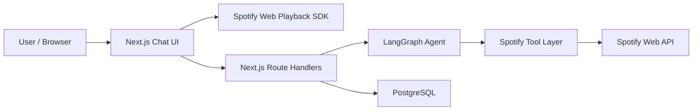

# Architecture

## ゴール

ユーザーが日本語で「もう少し落ち着いた曲にして」「夜のドライブ向けに変えて」のように話しかけると、LLM が意図を解釈し、LangGraph 上のツールを使って Spotify の再生内容を変える Web アプリを作ることです。

## システム構成

## レイヤー設計

### 1. フロントエンド

- Next.js App Router
- チャット中心 UI
- Spotify 接続状態の表示
- ブラウザを再生デバイスとして登録
- 現在再生中の曲、デバイス、音量、進行状況の可視化

### 2. API レイヤー

- `/api/auth/spotify/login`: Spotify OAuth 開始
- `/callbacks`: code exchange と接続完了
- `/api/session`: 現在の接続情報と会話履歴を返す
- `/api/chat`: ユーザー発話を LangGraph に渡す
- `/api/spotify/token`: Web Playback SDK 用アクセストークンを返す
- `/api/player/device`: ブラウザの `device_id` を保存して転送
- `/api/playback`: 再生状態取得

### 3. エージェントレイヤー

LangGraph では次の流れを取ります。

1. ユーザー入力を受ける
2. LLM が必要な Spotify ツールを判断する
3. ToolNode が Spotify API を実行する
4. 最終的な説明文を日本語で返す

この構成により「意図理解」と「実際の再生操作」を分離できます。

## 主要ツール

- `get_current_playback`
- `search_tracks`
- `search_playlists`
- `play_tracks`
- `play_playlist`
- `pause_playback`
- `resume_playback`
- `skip_to_next`
- `skip_to_previous`
- `set_volume`
- `queue_track`

## データモデル

### Session

- ブラウザ単位のセッション
- OAuth state / PKCE verifier を保持

### SpotifyConnection

- Spotify user id
- 暗号化済み access token / refresh token
- access token expiry
- 現在優先したい browser device id

### ChatMessage

- session 単位のユーザー/AI 会話ログ

## MVP までの流れ

1. Spotify OAuth を成立させる
2. DB に接続情報を保存する
3. Web Playback SDK でブラウザ device を登録する
4. LangGraph から `search -> play` を通す
5. チャット UI で自然言語操作を成立させる

## 本番化で追加したいもの

- Redis か Postgres を使った LangGraph checkpoint 永続化
- 楽曲レコメンドの品質改善用プロンプト評価
- ユーザーの再生履歴や liked songs を使った好み推定
- レート制限と監査ログ
- Spotify token の鍵管理を KMS / Secret Manager に移行
- HTTPS を自己署名ではなく正規証明書に変更
